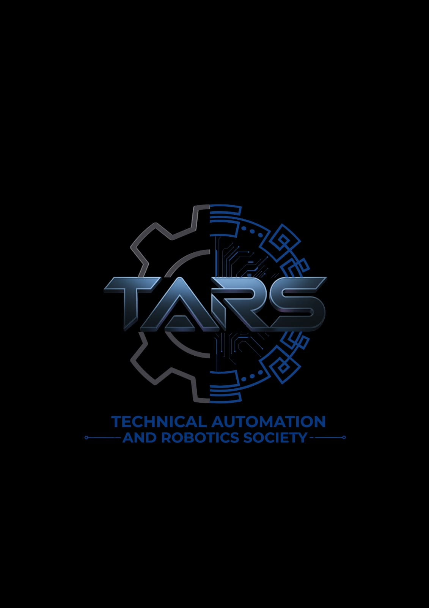

# T.A.R.S. - Technical Automation and Robotics Society



The official website for the **Technical Automation and Robotics Society (TARS)**. This single-page application showcases the committee's vision, core node departments, futuristic rover models, and interactive network features.

## 🛠️ Getting Started

### Prerequisites
Make sure you have [Node.js](https://nodejs.org/) installed on your machine.

### Local Setup
1. Clone the repository:
   ```bash
   git clone https://github.com/DevangKore17/tars_website_frontend.git
   ```

2. Navigate into the directory:
   ```bash
   cd tars_website_frontend
   ```

3. Install the dependencies:
   ```bash
   npm install
   ```

4. Start the development server:
   ```bash
   npm run dev
   ```

5. Open your browser and navigate to `http://localhost:5173`.

## 📝 License
Copyright © TARS Committee. All rights reserved.
